---

## 👋 About Me

> Aspiring software engineer who likes building things that feel good to use — clean interfaces, real data, and a little personality.

> [!NOTE]
> **Open to New Grad Software Engineer roles and internships.**
> Graduating **November 2026** and available immediately after.

- 🎓 &nbsp;**B.S. Computer Science** at *Florida Atlantic University*, minor in **Cybersecurity** — based in South Florida
- 💼 &nbsp;Former **Software Engineer Intern @ Givelify**, where I cut donation-checkout defects by **30%** with automated UI test suites
- 🧪 &nbsp;At home on both sides of the stack — React front ends, and the **Mocha / WebdriverIO / Jenkins** pipelines that keep them honest
- 🏆 &nbsp;Built a dividend-analysis desktop app in under **36 hours** at **ShellHacks 2025**
- 🤝 &nbsp;**Event Chair, National Society of Black Engineers** — grew chapter participation by **30%**
- 🌱 &nbsp;Currently going deeper on full-stack React and backend databases
- 💬 &nbsp;Ask me about React, Supabase, test automation, or why Jujutsu Kaisen keeps showing up in my projects
- 🏀 &nbsp;Naruto is my favorite anime, and ball is life

---

## Tech Stack

<b>Languages</b>

 

<b>Frameworks & Libraries</b>

 

<b>Testing & CI</b>

 

<b>Backend & Tools</b>

 

---

*"Hard work is worthless for those that don't believe in themselves."*

